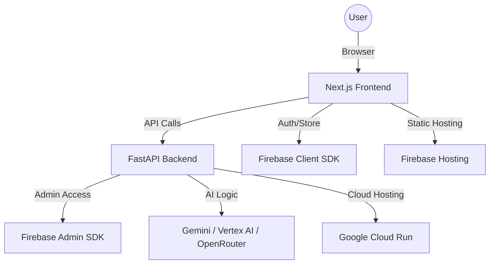

# 🚀 Aero AI: Complete Development & Architecture Guide

This guide provides a step-by-step overview of how the **Aero AI (Aerophysics)** platform is built, the languages used, and how to connect the cloud services.

---

## 🏗️ 1. High-Level Architecture

The project follows a **Decoupled Full-Stack Architecture**:

- **Frontend**: A lightning-fast dashboard built with Next.js.
- **Backend Hub**: A Python-based "Brain" that handles AI, Voice, and Database syncing.
- **Cloud Infrastructure**: Google Cloud & Firebase for hosting and data.

---

## 💻 2. Languages & Frameworks

| Part         | Tech                             | Why?                                                                          |
| :----------- | :------------------------------- | :---------------------------------------------------------------------------- |
| **Frontend** | **TypeScript & React (Next.js)** | Strict typing for reliability, React for interactive UI, Next.js for routing. |
| **Styling**  | **Tailwind CSS**                 | Utility-first CSS for rapid, modern design.                                   |
| **Backend**  | **Python (FastAPI)**             | Best ecosystem for AI (Gemini, PyPDF) and very fast performance.              |
| **Database** | **Firestore (NoSQL)**            | Real-time updates and seamless scaling.                                       |
| **Auth**     | **Firebase Auth**                | Easiest way to implement Google/Email login safely.                           |

---

## 🧠 3. Creating the Backend (Step-by-Step)

The backend is located in the `/backend` folder.

1.  **Environment Setup**:
    - Use `FastAPI` to create endpoints (like `/api/chat` or `/api/voice`).
    - Use `uvicorn` as the server to run the Python code.
2.  **AI Integration**:
    - **Google Gemini**: The primary AI engine.
    - **Vertex AI**: Enterprise-grade AI tools from Google Cloud.
    - **OpenRouter**: A "fallback" to ensure the AI always works if Gemini is over-limit.
3.  **Security**:
    - We use a `serviceAccountKey.json` file. This is a private "Master Key" from the Firebase Console that gives the Python code permission to manage your database.

---

## 🔥 4. Connecting Firebase

Firebase handles your **Users** and **Data**.

1.  **Frontend Connection**:
    - You get a "Config Object" from the Firebase Console (API Keys, Project ID).
    - You initialize the Firebase App in `src/lib/firebase.ts`.
2.  **Backend Connection**:
    - You download the **Service Account JSON** from Project Settings -> Service Accounts.
    - You place it in the `backend/` folder.
    - The Python code uses `firebase_admin` to connect.
3.  **Real-time Features**:
    - When a user chats, the Python backend saves the message to Firestore.
    - The frontend "listens" to Firestore and updates the chat screen instantly.

---

## ☁️ 5. Connecting Google Cloud

Google Cloud is where the "Brain" (Backend) lives 24/7.

1.  **Hosting the Python Code**:
    - We use **Google Cloud Run**. It takes your Python folder, turns it into a "Container," and puts it on a public URL.
    - **Command**: `gcloud run deploy --source .`
2.  **API Connections**:
    - You enable the **Vertex AI API** in the Google Cloud Console. This allows your backend to use advanced Gemini models directly.
3.  **Linking Frontend & Cloud**:
    - Once Cloud Run gives you a URL (e.g., `https://backend-xyz.run.app`), you put that URL into your frontend's `.env.local` file.

---

## 🚀 6. The Step-by-Step Roadmap

If you were to build this from scratch today, here is the order:

1.  **Project Init**: Create Next.js app and Python environment.
2.  **Firebase Setup**: Create a project in Firebase Console and enable Auth/Firestore.
3.  **Frontend Foundation**: Build the Sidebar, Dashboard, and Login page.
4.  **Backend "Brain"**: Create the FastAPI server and write the basic AI chat logic.
5.  **Data Sync**: Connect the Backend to Firestore using the Service Account.
6.  **Advanced Features**: Add Voice AI, PDF parsing, and Roadmap generators.
7.  **Cloud Deployment**: Use `gcloud` to deploy the backend and `firebase deploy` for the frontend.

---

### 💡 Pro Tip

Check your [**MANAGEMENT.md**](file:///d:/Antigravity/first%20try/MANAGEMENT.md) for all the specific links and commands used in **this** project!
